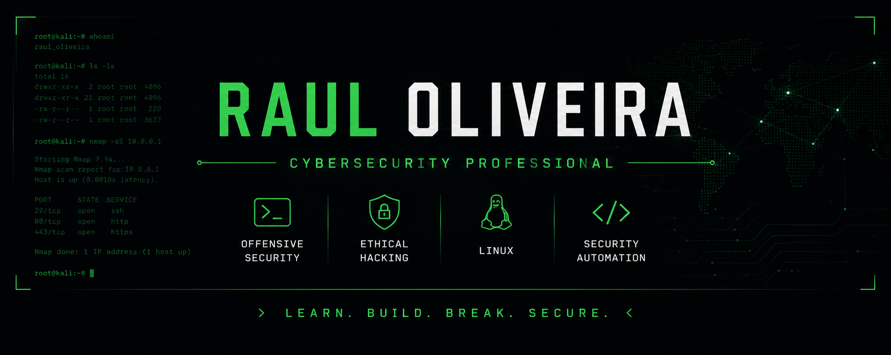

  

<h1 align="center">Raul Oliveira</h1>

Cybersecurity Professional • Offensive Security • Ethical Hacking • Linux • Security Automation

<i>Learn. Build. Break. Secure.</i>

## 🧑‍💻 About Me

Hi! I'm Raul, a Cybersecurity Professional passionate about Offensive Security, Ethical Hacking, Linux and Security Automation, with a growing interest in Digital Forensics.

I enjoy building hands-on labs, developing practical cybersecurity projects and documenting my learning journey through real-world challenges and technical research.

My goal is to continuously improve my offensive security skills, deepen my technical expertise and contribute to the cybersecurity community by creating well-documented, practical and impactful projects.

## 💡 Philosophy

> Learn. Build. Break. Secure.

I believe cybersecurity is learned through curiosity, consistency and hands-on practice.

Every project in this portfolio represents a step toward becoming a better security professional.

## 🎓 Education

- **Technical Specialist in Cybersecurity** *(EQF Level 5)*  
  Focused on Offensive Security, Digital Forensics, Network Security, Incident Response and Security Operations.

- **Computer Technician**  
  Strong foundation in computer systems, networking, operating systems and technical support.

- **Mechatronics Technician**  
  Background in electronics, automation, embedded systems and industrial technologies.

### 🌍 Languages

- 🇧🇷 Portuguese (Native)
- 🇺🇸 English (Technical Proficiency)

## 🛠 Core Competencies & 💻 Tech Stack

<table>
<tr>
<td valign="top" width="50%">

### 🛠 Core Competencies

#### 🔴 Offensive Security
- Penetration Testing
- Vulnerability Assessment
- Web Application Security
- Network Security Testing

#### 🔵 Defensive Security
- Incident Response
- Security Monitoring
- System Hardening
- Network Defense

#### 🔍 Digital Forensics
- Disk Analysis
- Memory Analysis
- Evidence Collection
- Timeline Analysis

#### 🖥 Systems Administration
- Linux Administration
- Windows Administration
- Active Directory
- Server Administration

#### 🌐 Networking
- TCP/IP
- DNS
- DHCP
- Routing & Switching
- Firewalls
- VPN

#### ⚙ Security Automation
- Python Scripting
- Bash Scripting
- PowerShell
- SQL

</td>

<td valign="top" width="50%">

### 💻 Tech Stack

#### 🖥 Operating Systems
- Linux
- Windows
- Windows Server

#### ☁️ Virtualization & Containers
- Proxmox VE
- QEMU/KVM
- Virt-Manager
- VMware
- VirtualBox
- Docker
- Podman
- Distrobox

#### 🌐 Infrastructure
- Apache
- Nginx
- Nginx Proxy Manager
- IIS
- Active Directory

#### 🔐 Security Tools
- Nmap
- Wireshark
- Burp Suite
- Metasploit
- OWASP ZAP
- Autopsy
- Maltego
- Gophish
- OSINT Framework
- Hashcat
- John the Ripper

#### 💻 Programming
- Python
- Bash
- PowerShell
- Ruby
- SQL

</td>
</tr>
</table>
~

## 📂 Projects

Explore my cybersecurity projects organized by learning progression and specialization.

| Category | Description |
|:---------|:------------|
| 🟢 **Beginner Labs** | Fundamental cybersecurity labs covering Linux, networking, scripting and core security concepts. →📁 [Browse](https://github.com/raul-oliveirah/cybersecurity-beginner-labs) |
| 🟡 **Intermediate Labs** | Practical projects involving Active Directory, web security, privilege escalation and infrastructure. 📁 [Browse](https://github.com/raul-oliveirah/cybersecurity-intermediate-labs) |
| 🔴 **Advanced Labs** | Advanced attack simulations, detection engineering, research and complex lab environments. → 📁 [Browse](https://github.com/raul-oliveirah/cybersecurity-advanced-labs) |
| ⚔️ **Offensive Security** | Penetration testing, exploit development, web security and offensive security projects. →📁 [Browse](https://github.com/raul-oliveirah/offensive-security) |
| 🔵 **Blue Team** | Detection engineering, incident response, threat hunting and defensive security projects. → 📁 [Browse](https://github.com/raul-oliveirah/blue-team) |
| 🔍 **Digital Forensics** | Memory analysis, disk forensics, evidence collection and DFIR investigations. → 📁 [Browse](https://github.com/raul-oliveirah/digital-forensics) |
| 🤖 **Security Automation** | Python, Bash and PowerShell automation scripts for cybersecurity and infrastructure. → 📁 [Browse](https://github.com/raul-oliveirah/security-automation) |
| 🏴 **CTF Write-ups** | Documented walkthroughs, methodologies and lessons learned from CTF platforms. → 📁 [Browse](https://github.com/raul-oliveirah/ctf-writeups) |

## 📜 Certifications

### 🏆 Professional Certifications

> *Currently building my professional certification path.*

- *(Coming Soon)*

### 🎓 Training & Learning Platforms

- Cisco Networking Academy
- Fortinet Training Institute
- TryHackMe
- Hack The Box
- Google Cybersecurity

## 🎯 Current Goals

- [ ] Build a professional cybersecurity portfolio
- [ ] Publish 50 hands-on cybersecurity projects
- [ ] Earn industry-recognized cybersecurity certifications
- [ ] Improve Python skills for security automation
- [ ] Contribute to open-source cybersecurity projects

## 📚 Currently Learning

- Active Directory Security
- Linux Hardening
- Python for Security Automation
- Web Application Security

## 📫 Contact

- 💼 [LinkedIn](https://www.linkedin.com/in/raul-oliveira-a6668a298/)
- 📧 Email 

